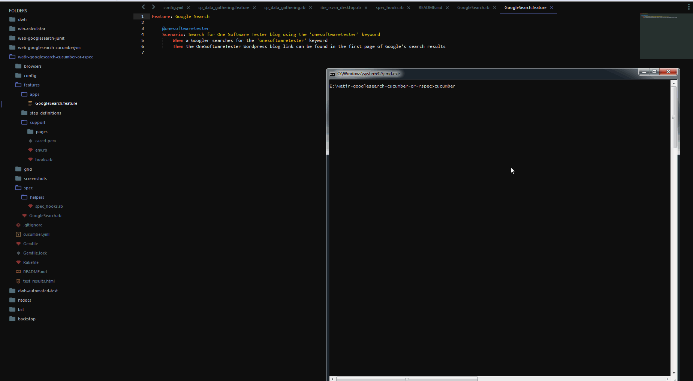
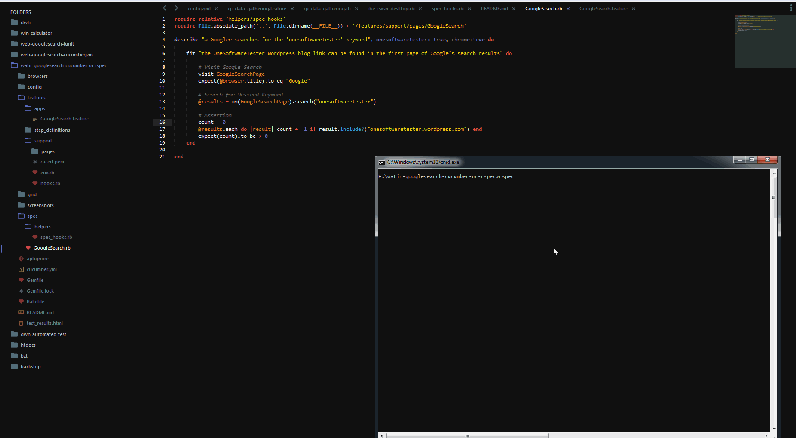

Watir-GoogleSearch-Cucumber-Or-RSpec
====================================

Source code for very basic Google Search automation example, using `Watir`, with code written in `Ruby`, and gem dependencies managed by `Bundler`. This example has an integration with `Cucumber` to provide a way of defining a test description language, in this case using the common `Given-When-Then` pattern. The example also integrates to `RSpec`, using the `Describe-It` pattern, if the tester desires to use RSpec instead of Cucumber.

Test runs using the `cucumber` or `rspec` command, on a Google Chrome web browser by default, but can be set to run on Mozilla Firefox if desired.

**The Test:** Search for the `onesoftwaretester` keyword in Google and check if the first page results of the search contains links to the [OneSoftwareTester blog](https://onesoftwaretester.wordpress.com/).

## Steps

1. Install Ruby and the Ruby Development Kit
2. Clone or download this repository
3. Open a terminal / command line of your choice and navigate to your local repository
4. Run `bundle install` to install gem dependencies
5. Run `cucumber` or `rspec spec/GoogleSearch.rb` to run the test on a Google Chrome browser, or
6. Run `cucumber BROWSER=firefox` to run the same test on a Mozilla Firefox browser
7. Pass a `-t @onesoftwaretester` command in the test if you want to try Cucumber's tag functionality

Author: **Jason Ogayon**